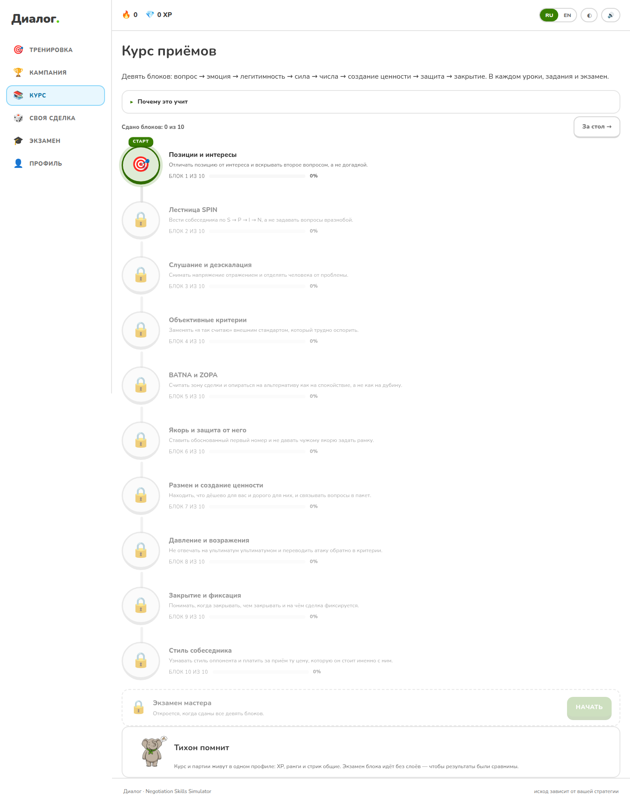
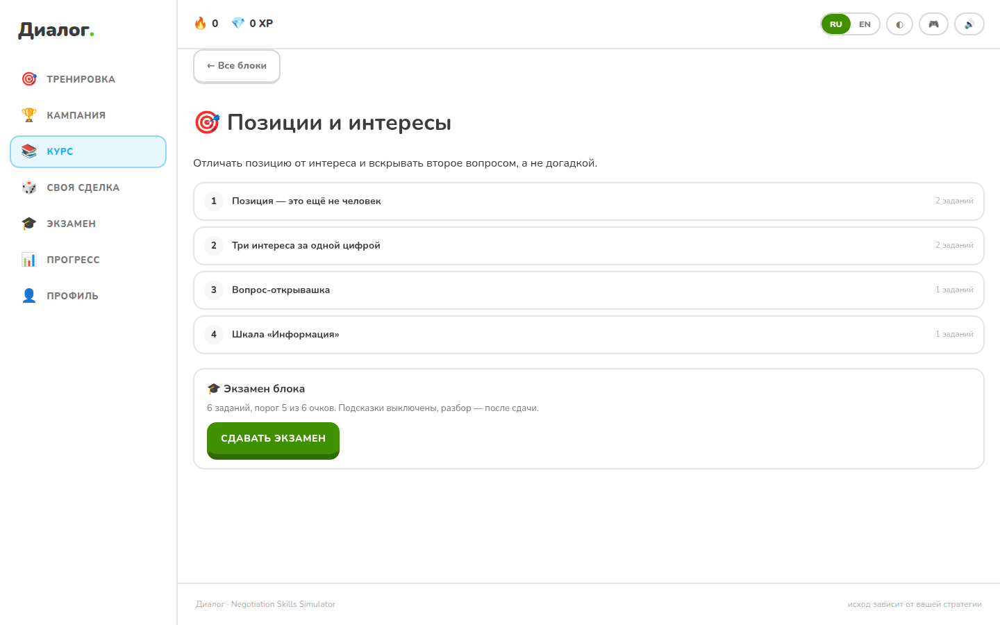
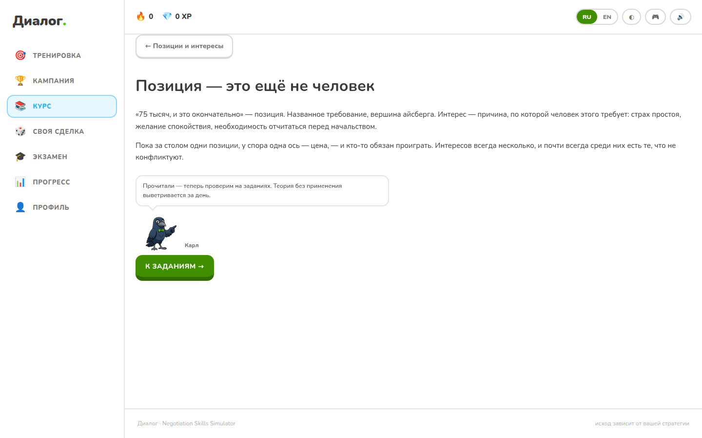
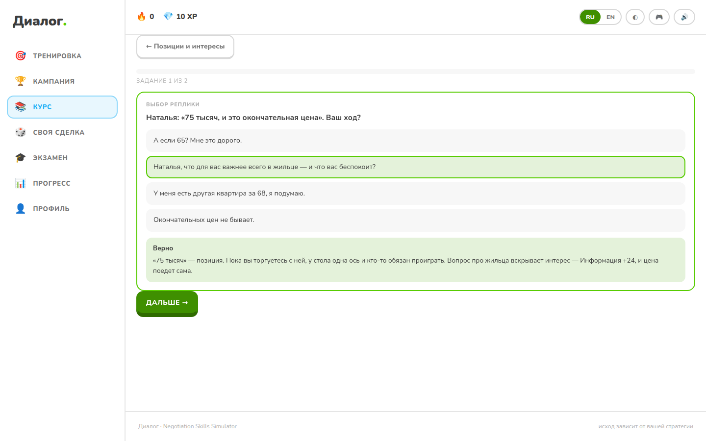
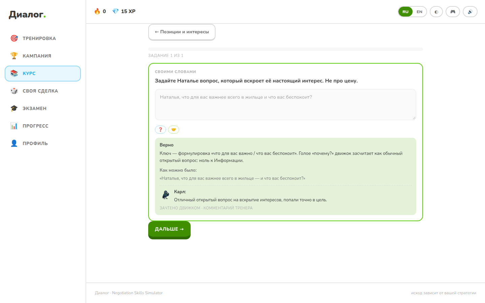

# Курс приёмов

Десять блоков, 42 урока, 90 упражнений десяти типов, экзамен в каждом блоке и
капстоун — настоящая партия — в каждом блоке. Кампания учит играть партию целиком;
курс учит одному приёму за раз и проверяет его так, чтобы «выучил» отличалось от
«пролистал».

---

## 1. Почему банк не написан, а доказан

Учебный курс поверх симулятора ломается одинаково у всех: автор пишет
«правильный ответ», потом кто-то правит баланс движка — и урок тихо становится
ложью. Единственная защита от этого — сделать так, чтобы расхождение **валило
сборку**.

Поэтому банк живёт в Python рядом с движком (`app/course/bank.py`), а
`tests/test_course_bank.py` прогоняет каждый пункт через настоящий
`analyze()` / `apply_move()` — на обоих языках:

| Тип | Что доказывает тест |
|---|---|
| `choice` | верный вариант действительно даёт заявленные приёмы (`expect_moves`) |
| `freeform` | эталонный ответ проходит тот же предикат, которым судят игрока |
| `reaction` | записанная реакция совпадает с той, что вернул `apply_move` |
| `meters` | шкала с наибольшим сдвигом совпадает с расчётом движка |
| `numeric` с `derive` | число пересчитано из `scenarios.py`, а не переписано руками |
| `spot_error` | верный вариант привязан к своему `fault_key` |
| `order` / `match` | ответ покрывает ровно свои элементы и является биекцией |
| `drill` | предикат смотрит ТОЛЬКО в поля движка **и** капстоун реально проходится |

592 проверки в `test_course_bank.py`. Правка лексикона, баланса или сценария,
расходящаяся с курсом, падает в CI — вместо того чтобы молча оставить в уроке
неверный ответ.

Семь из этих проверок стоят отдельно, потому что закрывают щели, где обещание
курса держалось ни на чём:

- **дистракторы `choice`.** «Верный вариант даёт приём» ничего не доказывает, если
  тот же приём даёт соседний вариант. Теперь неверные варианты обязаны его НЕ
  давать — на обоих языках.
- **`choice` без `expect_moves`.** Четыре пункта (`bz-03`, `lr-01`, `cl-02`,
  `st-01`) сверить с движком нельзя: их варианты — не реплики игрока, а суждения о
  движке («сделка закроется на 84») или реплики оппонента, по которым опознают
  стиль. Они перечислены в тесте поимённо с причиной; новый `choice` без
  `expect_moves` валит сборку, пока причина не названа.
- **`spot_error.bad_line`.** Ключ ошибки сверялся со строкой в вариантах, то есть
  доказывал лишь то, что автор дважды написал одно слово. Теперь плохая реплика
  прогоняется через `analyze()` и обязана быть плохой ДЛЯ ДВИЖКА. Исключение —
  `repeat_same_line`: этой ошибки нет в одной реплике, она доказывается партией
  (второй дословный повтор режет качество аргумента до 12).
- **капстоун в каждом блоке и на своём столе.** Экзамен добавляет капстоун «если
  он есть» и весит его вдвое; блок без капстоуна проверял бы чистое узнавание, а
  капстоун на чужом столе — что угодно, кроме пройденного блока. Это
  `test_every_block_has_a_capstone_on_its_own_table`.
- **имя собеседника.** Разбор `bz-07` писал «Открылся Павел с 30%» — а за столом
  инвестора сидит Марина, Павел же основатель со стола ставки фрилансера. Ни один
  тест этого не видел: текст двуязычный, приёмы верные, число верное. Теперь
  `test_exercise_never_names_a_counterpart_from_another_table` сверяет каждое
  упоминание с `counterpart.name` того сценария, на который упражнение ссылается,
  а `..._lesson_never_names...` — то же для уроков; урок, который перечисляет
  столы нарочно, назван исключением с причиной.
- **вопрос, который в игре не работает.** Образцовый вопрос всего первого блока —
  «что для вас важнее всего в жильце» — обещал Информацию +24, а движок отвечал
  переспросом и давал 5: реплика не попадала ни в одно ключевое слово интереса.
  Урок учил ходу, проигрывающему партию, — прямое нарушение инварианта 9. Теперь
  `test_a_correct_question_actually_uncovers_an_interest` прогоняет верную реплику
  каждого пункта и требует, чтобы вопрос ДЕЙСТВИТЕЛЬНО вскрывал интерес — на обоих
  языках, потому что словари тем у RU и EN разные. Два пункта, где непопадание и
  есть предмет урока (`fo-08`, `al-01`), перечислены поимённо с причиной.
- **проходимость капстоуна.** Условия «сделка ≤ X И два интереса И напряжение ≤ Y
  за шесть ходов» могут оказаться несовместимыми после правки баланса. Тест играет
  принципиальную линию — свою на каждом столе, потому что вторичные фишки у столов
  разные — и требует, чтобы она проходила каждый капстоун на обоих языках. И
  обратное: линия из грубости и ультиматумов не проходит ни одного.

## 2. Один словарь приёмов на два языка исполнения

Классификатор хода жил дважды: `techniques.py` на сервере и `lib/techniques.ts`
в браузере (чипы под композером, офлайновый мок, проверка упражнений). Списки
разъехались — одна и та же реплика получала разные приёмы на клиенте и сервере.

Теперь Python — источник, `frontend/src/lib/lexicon.generated.ts` — генерация
(`tools/sync_lexicon.py`), `tests/test_lex_parity.py` — сторож. То же и с самим
курсом: `tools/sync_course.py` → `frontend/src/data/course.generated.ts`,
`tests/test_course_sync.py`.

Пять дефектов, найденных и закрытых по пути (каждый делал «правильный ответ»
неправильным в игре):

1. «по рыночным данным» не считалось объективным критерием — при том, что эту
   формулировку предлагала сама подсказка продукта;
2. EN-лексикон не знал `important to you`, `what matters more`;
3. EN не ловил размен `can you move down` / `if you add`;
4. «или я ухожу» не читалось как ультиматум — штраф не начислялся;
5. TS-словарь содержал записи, которых не было в Python (и наоборот);
6. урок «Лестница реакций» перечислял десять состояний прозой, и **английский
   список шёл в другом порядке**, чем шкала движка: переставлены
   `neutral`/`not_yet` и `collaborated`/`opened_up`. Английский урок учил
   лестнице, по которой в игре не строятся ни соседи по шкале теплоты, ни
   дистракторы «прочитай лицо». Теперь урок СОБИРАЕТСЯ из константы
   `blocks.py::REACTION_LADDER`, а её порядок сверяется со шкалой и её состав —
   с реакциями, которые реально присваивает `apply_move`.

## 3. Типы заданий

`choice` · `spot_error` · `order` · `match` · `numeric` · `freeform` ·
`reaction` · `meters` · `face` · `drill`.

`drill` — капстоун блока, по одному на блок (см. §4).

`face` — «прочитай лицо»: тот же кадр состояния, который оппонент показывает за
столом (`public/avatars/<сценарий>/<состояние>.webp`). Картинок меньше, чем
реакций — `nod` и `smile` рисуются как `warm`, `shake_head` как `annoyed`, —
поэтому тест банка проверяет, что ни один дистрактор не выглядит ТАК ЖЕ, как
верный ответ. Иначе у задания было бы два одинаково верных ответа.

Проверка **у всех детерминированная**. ИИ в зачёте не участвует нигде — курс
обязан работать офлайн ровно так же, как партия (инвариант «без сети продукт
полностью играбелен»). Судья (`NEGO_JUDGE`) может добавить комментарий к
свободному ответу, но не решает, зачтено ли упражнение.

При этом он ЗНАЕТ задание и вердикт — иначе получалось два ответа на разные
вопросы в одном экране: предикат валил реплику как ответ на это задание, а
тренер хвалил её как реплику в переговорах («Не то» рядом с «отличный размен»).
Требования тренер получает из банка, а не с клиента; вердикт он объясняет, а не
пересматривает — та же схема, что у разборщика партии.

Честное ограничение, названное вслух: предикат `freeform` ловит **форму** хода,
а не смысл. Смягчается порогами (`min_words`, `min_arg`), запретами
(`forbid_moves`) и требованием попасть во вторичный вопрос
(`require_secondary`). Для тренажёра этого достаточно — и это прозрачно, в
отличие от «оценил ИИ, а почему — неизвестно».

`require_secondary` — самый строгий из них: он требует НАЗВАТЬ конкретную
вторичную фишку («годовой контракт», «предоплата»), а не «разменять
что-нибудь». Это ровно то, за что движок платит пакетным баллом: цена двигается
на `0.10 + 0.30·ценность_для_них`, и безымянное «пойдём навстречу» не двигает её
вовсе — это `concession`, а не размен. Пользуются им `lr-07` и `lr-08`; до них
предикат был описан, реализован на обеих сторонах и **не вызван ни разу** —
поэтому никто не замечал, что питоновская половина падала с `AttributeError`, а
браузерная работала. Предикат без пользователя не «готов», он просто не проверен.

## 3.1. Чего курс НЕ объяснял

Банк доказан против движка — но доказанность не отвечает на вопрос «а всё ли
вообще названо». Аудит содержания нашёл пять дыр, и все пять одинаковой
природы: механика в движке есть, влияет на исход, а в уроках её нет.

**Порог доверия.** `trust > reveal_trust_gate(sess)` — самая контринтуитивная
механика продукта: идеальный вопрос на холодном столе не вскрывает ничего.
Порог зависит от сложности стола: 30 у самого лёгкого, дальше +2 за ступень
(32 у зарплаты, 34 у конфликта, 36 у инвестора) при стартовом доверии 40.
Не объяснял этого ни один урок. Теперь это `foundations`, урок 5 «Интерес
открывается на доверии», а упражнение `fo-08` — тот же вопрос на столе с
доверием 18: Информация растёт на 5 вместо 24, и сильнее всего двигается
напряжение. Ответ, как у всех `meters`, вычислен движком.

**probe_vague.** Оппонент переспрашивает («а что именно вас интересует?») в двух
случаях: доверие под порогом и вопрос не по теме ещё не вскрытого интереса.
Реакции нет на шкале теплоты, поэтому она НЕ МОЖЕТ быть ответом упражнения —
`reactionOptions` не соберёт на ней дистракторов, и это стережёт тест
`test_no_exercise_answer_is_a_reaction_the_layer_cannot_ask_about`. Но объяснить
её надо, иначе главное правило «интерес вскрывается только вопросом по теме»
остаётся без наблюдаемого следствия. Объяснена в том же уроке 5.

**Стиль собеседника.** `analytical` / `relationship` / `tough` дают настоящие
модификаторы — критерий аналитику +6 рычага (16 → 22), названная альтернатива
«отношенцу» +6 напряжения (4 → 10 с опорой, 14 → 20 без), ультиматум жёсткому
+8 напряжения (22 → 30). Упоминались вскользь в разборах двух упражнений.
Теперь это десятый блок «Стиль собеседника».

**Десятый стол.** `candidate_offer` — единственный сценарий, где сила у ИГРОКА:
дно кандидата 210 лежит НИЖЕ цели 230, и экономика на цели уже равна ста. Курс
про это молчал, а урок здесь ровно один и его нельзя вывести из остальных: сила
нужна, чтобы не торговаться. Это урок 4 нового блока плюс `st-05` (`numeric`,
число выведено `derive.target_slack`), `st-06`, `st-07` и капстоун `st-08`.

**Первое слово.** Блок «Якорь» учит ставить свой первый номер: `an-07`
начинается словами «Вы приехали первым и говорите первым», `an-10` просит
произнести якорь своими словами. За столом этой ситуации не было НИ РАЗУ —
`views.greeting_line` открывал торг цифрой оппонента на всех девяти столах, и
игроку оставалось только защищаться. Ответ упражнения был доказан против движка
как РЕПЛИКА и невозможен как ХОД: инвариант 9 нарушался не буквой, а смыслом.

Теперь оппонент здоровается без цифры и отдаёт первое слово, а обоснованный
якорь, поставленный до его числа, двигает рамку стола (`engine._anchor_frame`):
у Сергея 1200 → 1170 ещё до уступки, и дальше торг считается от 1170. Голая
цифра рамку не двигает — событие «критерий» требует качества довода ≥ 35.
Сдвиг ограничен пятой частью размаха, поэтому «мы предлагаем 700» тянет рамку
ровно настолько же, насколько обоснованные 1080, и дно оппонента не переходится
никогда. Приём стоит +6 техники — до этого «якорение» было чипом под
композером, которого счёт не замечал.

Гейт — именно приём `anchor`, а не любое первое число, и это замерено: с
условием «anchor или offer» партия «чередование» из `games.json` поднималась с
28 до 30 и обгоняла базовую игру, то есть анти-гейминговая лестница
переворачивалась. Держат это `tests/test_first_word.py` (51 проверка, оба
языка) и раздел `first_word` в `games.json` — две партии, отличающиеся ТОЛЬКО
первой репликой, сверяемые с браузерным зеркалом до балла.

**Покрытие реакций.** Из десяти состояний шкалы теплоты упражнения `reaction` и
`face` спрашивали про шесть. Добавлены `neutral` (`fo-10`), `warmed` (`al-09`),
`persuaded` (`oc-08`), `not_yet` (`an-09`), `pressured` в варианте со стилевой
надбавкой (`bz-10`) и `hardened` на жёстком столе (`st-03`). Теперь покрыты все
десять — а одиннадцатая, `probe_vague`, покрыта уроком и запрещена тестом.

## 3.2. Второй такт: узнал — теперь произнеси

Половина банка была узнаванием: `choice`, `spot_error`, `match`, `order`,
`numeric`, `face` — 42 пункта из 84. Это самый дешёвый режим переноса навыка.
Узнать хороший вопрос среди четырёх и ЗАДАТЬ его живому человеку — разные
умения, а тренажёр переговоров ценен ровно вторым.

Поэтому за `choice` теперь идёт `freeform` **на том же материале и в том же
уроке**: узнал приём — произведи его своими словами. Добавлено шесть пар,
`an-03` переехал из урока 2 в урок 3 к своему `choice`:

| Урок | Узнавание | Производство | Что нового требует предикат |
|---|---|---|---|
| Позиции и интересы · 5 | `fo-09` | `fo-11` | активное слушание без цены и без уступки под порогом доверия |
| Лестница SPIN · 4 | `sp-07` | `sp-10` | ступень N — единственная, которую банк не производил ни разу |
| Слушание · 1 | `al-01` | `al-10` | назвать чувство, НЕ соглашаясь: запрет уступки и согласия |
| Якорь · 2 | `an-07` | `an-10` | поставить свой якорь: `anchor` + критерий + число разом |
| Якорь · 3 | `an-02` | `an-03` | защита контр-якорем — производство переехало к своему узнаванию |
| Давление · 1 | `pd-01` | `pd-08` | первый из трёх ответов на ультиматум: без цифры, без согласия |
| Стиль · 3 | `st-04` | `st-09` | с аналитиком критерий ПЕРЕД разменом: `tradeoff` запрещён |

Второй такт добавлен не везде, и это часть замысла. Шесть уроков остались без
него с названной причиной — они перечислены в
`CHOICE_WITHOUT_A_SECOND_BEAT`, и новый `choice` без пары валит сборку, пока
причина не названа. Причины двух видов: **производить нечего** — варианты не
реплики игрока, а суждение о движке (`bz-03` — арифметика красной линии, `cl-02`
— предсказание точки закрытия, `lr-01` — ценность фишек) или реплики ОППОНЕНТА,
по которым узнают стиль (`st-01`); и **второй такт уже стоит рядом** на том же
столе и с тем же приёмом (`fo-01` → `fo-04`, `oc-06` → `oc-02`). Пара ради
симметрии — это не тренировка, а копия.

**Предикат обязан пользоваться всем, что у него есть.** Один `require_moves`
зачтёт реплику с правильными словами и без содержания: «насколько важно?» — это
формально ступень N, а в игре переспрос и +5 к Информации вместо +22. Поэтому
`test_freeform_predicate_uses_more_than_one_guard` требует у КАЖДОГО свободного
пункта три вещи: запрет на приёмы, которые ломают урок (`forbid_moves`), порог
длины (`min_words` ≥ 5) и хотя бы одну проверку веса реплики — качество довода,
число или названную вторичную фишку. Один пункт (`sp-08`) этому не отвечал:
ступень S сама по себе даёт 34, и «как у вас сейчас?» проходила за четыре слова.

Запреты у новых пунктов не декоративны, каждый закрывает свой способ
сжульничать: `offer`/`anchor` — ответить на ультиматум или на порог доверия
цифрой; `concession`/`accept` — «понимаю, мы виноваты, готовы уступить», где то
же активное слушание тащит за собой уступку, за которую движок не платит ничего
(цена ходит только за событием: вскрытый интерес, критерий, размен); `tradeoff`
в `st-09` — размен раньше критерия, то есть ровно тот порядок, против которого
урок и написан.

И главное: эталон каждого нового пункта прогоняется через настоящий движок
(`test_a_correct_question_actually_uncovers_an_interest`). Оба вопроса — `sp-10`
и `pd-08` — действительно вскрывают интерес на обоих языках, а не пополняют
список исключений: N-вопрос про загрузку даёт Информацию +22 и «приоткрывается»,
ответ на ультиматум про штрафы — +24, доверие +12, напряжение −13.

## 4. Капстоун

`drill` — не отдельная «учебная механика», а настоящая партия: тот же движок,
тот же протокол, слои принудительно выключены. Курс узнаёт результат из
состояния партии предикатом над полями `StateView` плюс лимит ходов.

**Капстоун есть в каждом блоке, и каждый стоит на столе своего блока.** Долгое
время он был ровно один — в блоке «Закрытие», — а экзамен добавляет капстоун
«если он есть». То есть восемь экзаменов из девяти проверяли ЧИСТОЕ УЗНАВАНИЕ
при том, что §5 обещает применение и весит капстоун вдвое.

Единственный капстоун с НИЖНЕЙ границей по цене — `st-08` на «Оффере сильному
кандидату»: сделка 230–240k при доверии ≥ 70. Ниже 230 экономика уже равна ста,
и «выжал ещё двадцать» проверяет не навык, а готовность заплатить отношениями за
ноль баллов.

Условия прохода — только поля `StateView`, и `terms_conceded` среди них быть не
может: это список идентификаторов, а не счётчик, и сравнение с числом в
браузерном зеркале даёт `NaN`. «Пакет собран» проверяется по следам, которые
пакет оставляет в шкалах, — доверие растёт на `3 + 4·ценность` за каждую
названную фишку.

Ни один сигнал слоёв (голос, камера, зрение) в предикат не входит — это тот же
инвариант, что и у `score_session`: результат со слоями обязан быть сравним с
результатом без них.

## 5. Экзамен блока

Выборка детерминирована от `(блок, попытка)`: пересдача даёт другую выборку, но
одну и ту же при повторе. Капстоун входит всегда и весит два очка: узнавание без
применения — не навык. Порог 80%.

Отдельного модуля экзамена нет: выборка живёт в `lib/course.ts::drawExam`, потому
что экзамен обязан считаться офлайн, как и весь остальной курс.

Во время экзамена подсказки и разбор выключены; разбор показывается целиком
после сдачи. Провал не откатывает прогресс и не тратит «жизни» — он
заканчивается **маршрутом**: уроки, к которым ведут именно ваши промахи.

## 5.0. Работа над ошибками

Промах не исчезает: упражнение попадает в список на переделку и висит на карте
курса карточкой «Работа над ошибками · N заданий». Верный ответ снимает его
оттуда — список существует ровно до тех пор, пока ошибка не исправлена.

Исправленная ошибка платит **половину XP**: навык тот же, но узнавание с первого
раза стоит дороже — иначе ошибаться нарочно было бы выгодно.

## 5.1. Экзамен мастера

Открыт, когда сданы все блоки курса. Три НАСТОЯЩИЕ партии подряд, и подсказок
нет ни одной. Свободных столов на три партии в игре не осталось: блоки стоят на
восьми сценариях из девяти, и вне их только `freelance_rate` — единственное
направление «выше лучше» в курсе. Он открывает экзамен; дальше два самых
трудных стола, `investor` и `used_car`. Знакомый стол здесь не проверяет память:
в блоке рядом стоял урок, а капстоун прямо называл нужный приём.

Каждая партия несёт своё условие прохода — предикат над полями движка, как у
капстоуна блока. Зачёт — две из трёх. Приёмы никто не подсказывает: реальные
переговоры тоже не сообщают, какой из них сейчас нужен.

**Финал не бывает легче дороги к нему.** Экзамен стоял на тех же столах, что и
два капстоуна, и просил меньше: `investor` — доля ≤ 22% за десять ходов против
≤ 20% за семь у капстоуна «BATNA и ZOPA», `used_car` — ≤ 1100k за восемь против
≤ 1080k за шесть у капстоуна «Якорь», и требования к напряжению у экзамена не
было вовсе там, где капстоун его ставил. Сейчас по каждой шкале, которую трогает
капстоун того же стола, экзамен требует не меньше, а лимит хода — не длиннее:
`investor` — доля ≤ 19%, все три интереса, напряжение ≤ 50, семь ходов;
`used_car` — ≤ 1070k, напряжение ≤ 40, шесть ходов. Держится это тестом
`test_master_exam_is_never_softer_than_its_block_capstone`, а не аккуратностью
редактора. У `freelance_rate` блока нет — сравнивать не с чем, и его условие
осталось прежним.

## 6. Как это выглядит

| | |
|---|---|
|  |  |
| Карта блоков: следующий открыт, остальные ждут | Блок: уроки и экзамен |
|  |  |
| Урок: теория, потом задания | Вердикт и разбор — всегда, и на верном ответе тоже |



Свободный ответ: зачёт поставил движок, комментарий добавил тренер — и подпись
говорит об этом прямо. Без сети карточки тренера просто нет.

## 7. Где что лежит

```
services/gateway/app/course/
  blocks.py     десять блоков, 42 урока и лестница реакций (билингвально)
  bank.py       90 упражнений, из них десять капстоунов — по одному на блок
  check.py      предикаты зачёта (зеркало: frontend/src/lib/course.ts)
  derive.py     числа, выведенные из scenarios.py
  simulate.py   прогон реплики через настоящий движок
  master.py     экзамен мастера: три партии на столах вне блоков
tools/sync_course.py     генерация зеркала для браузера
tools/sync_lexicon.py    генерация словаря приёмов для браузера
frontend/src/
  data/course.generated.ts     СГЕНЕРИРОВАНО
  lib/lexicon.generated.ts     СГЕНЕРИРОВАНО
  lib/course.ts                проверки, выборка экзамена, «что дальше»
  lib/courseTypes.ts           контракт
  components/CourseScreen.tsx  карта · блок · урок · экзамен
  components/Exercise.tsx      десять типов в одном презентере
```

Экзамена как файла нет — см. §5. `fault_key` у `spot_error` в интерфейсе тоже не
показывается: он существует ради сверки плохой реплики с движком, и потому обязан
быть доказуемым, а не декоративным.
